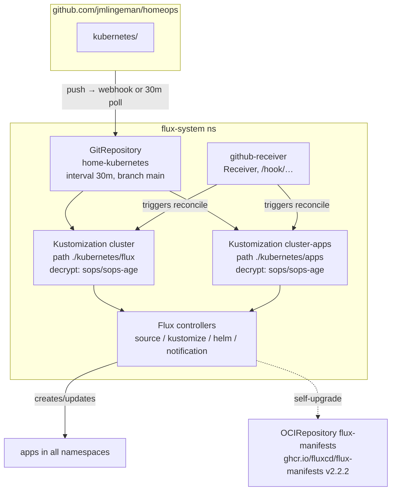
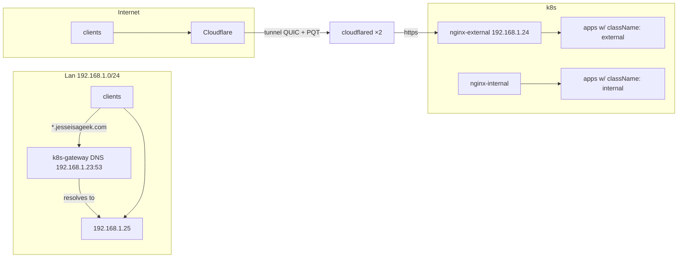

# 01 — Architecture

The cluster is a 2-node **k3s** (v1.3x, `k3s-ansible` role) home cluster managed end-to-end
by **Flux v2.2.2**. No external cloud: everything (ingress, DNS, storage, monitoring, certs)
is either in-cluster or on the LAN.

## Nodes & network

| Hostname | IP | Role |
|----------|----|------|
| `kube-controller` | 192.168.1.20 | k3s server (etcd, control-plane, runs workloads) |
| `kube-worker` | 192.168.1.21 | k3s agent (worker) |

VIPs (Cilium L2 / kube-vip style static IPs, see `bootstrap/vars/config.yaml`):

| IP | Purpose |
|----|---------|
| 192.168.1.22 | kube API (kube-vip virtual IP) |
| 192.168.1.23 | `k8s-gateway` — internal DNS (port 53) |
| 192.168.1.24 | `nginx-external` ingress LoadBalancer |
| 192.168.1.25 | `nginx-internal` ingress LoadBalancer |
| 192.168.1.30 | NFS server (media/storage host, `nfs.local`) |
| 192.168.1.211 | External Jellyfin/Plex VM (jellyfin static endpoint target) |

CIDRs: node `192.168.1.0/24`, pod `10.42.0.0/16`, service `10.43.0.0/16` (CoreDNS at 10.43.0.10).
Cilium LB mode: `dsr`.

## Control plane: Flux

- `kubernetes/flux/config/cluster.yaml` — `GitRepository` (`https://github.com/jmlingeman/homeops.git`,
  `ignore: /* ; !/kubernetes` so only `kubernetes/` is pulled) and the root `Kustomization cluster`
  that applies `./kubernetes/flux` (repos, vars, flux self-upgrade).
- `kubernetes/flux/apps.yaml` — `Kustomization cluster-apps` applying `./kubernetes/apps`.
  It has `prune: true`, sops decryption, and a **patch that adds sops decryption + the four
  `substituteFrom` sources (cluster-settings, cluster-secrets, cluster-settings-user,
  cluster-secrets-user) to every child Kustomization** (target: all Kustomizations lacking
  `substitution.flux.home.arpa/disabled != true`). New apps therefore get variable substitution
  and secret decryption for free — you never set those fields yourself.
- `kubernetes/flux/config/flux.yaml` — Flux upgrades itself from the `flux-manifests` OCI
  repository (v2.2.2); deployments patched with `--concurrent=8`, qps/burst bumps, OOM watch.
- `kubernetes/flux/repositories/helm/*.yaml` — all `HelmRepository` sources (see table below).
  `repositories/git/` and `repositories/oci/` are **empty** (no app is currently sourced from a
  separate git repo or OCI artifact — everything is in this repo).
- `kubernetes/flux/vars/` — `cluster-settings` (+user) ConfigMap and `cluster-secrets`
  (+user).sops.yaml Secret: the substitution variable sources (next section).
- `kubernetes/bootstrap/` — one-shot Flux install (kustomize `resources: github.com/fluxcd/flux2/manifests/install?ref=v2.2.2`,
  NetworkPolicies deleted for k3s). Applied manually by `task flux:bootstrap`; **never** part of
  Flux reconciliation (the `cluster` Kustomization does not include it).
- Webhook: `kubernetes/apps/flux-system/addons/webhooks/` — `github-receiver` (ping/push →
  reconcile `home-kubernetes`, `cluster`, `cluster-apps`), exposed at
  `flux-webhook.jesseisageek.com` through the **external** ingress; token in
  `secret.sops.yaml` (`github-webhook-token-secret`).

### HelmRepositories in use

| name | url | type | used by |
|------|-----|------|---------|
| jetstack | charts.jetstack.io | http | cert-manager |
| bitnami | oci://registry-1.docker.io/bitnamicharts | **oci** | postgresql |
| bjw-s | oci://ghcr.io/bjw-s/helm | **oci** | most app-template apps |
| cilium | helm.cilium.io | http | cilium |
| coredns | coredns.github.io/helm | http | coredns |
| descheduler | kubernetes-sigs.github.io/descheduler | http | descheduler |
| external-dns | kubernetes-sigs.github.io/external-dns | http | external-dns |
| firefly-iii | firefly-iii.github.io/kubernetes | http | (declared; firefly app uses app-template) |
| gitea | dl.gitea.io/charts | http | gitea |
| grafana | grafana.github.io/helm-charts | http | grafana |
| homarr | homarr-labs.github.io/charts | http | homarr |
| ingress-nginx | kubernetes.github.io/ingress-nginx | http | nginx internal/external |
| k8s-at-home | k8s-at-home.com/charts | http | grocy |
| k8s-gateway | ori-edge.github.io/k8s_gateway | http | k8s-gateway |
| kubernetes-dashboard | kubernetes.github.io/dashboard | http | kubernetes-dashboard |
| longhorn | charts.longhorn.io | http | longhorn |
| metrics-server | kubernetes-sigs.github.io/metrics-server | http | metrics-server |
| openebs | openebs.github.io/charts | http | openebs (local-hostpath) |
| piped | helm.piped.video | http | piped |
| prometheus-community | oci://ghcr.io/prometheus-community/charts | **oci** | kube-prometheus-stack |
| stakater | stakater.github.io/stakater-charts | http | reloader |
| csi-driver-nfs | raw.githubusercontent.com/…/csi-driver-nfs/master/charts | http | (declared; addon disabled) |
| backube, weave-gitops, piraeus, movetokube | — | — | (declared; no HelmRelease uses them — unused) |
| nerkho | charts.nerkho.ch | http | (file on disk but **not listed** in the repositories kustomization — orphaned) |

## Traffic ingress

Two ingress-nginx controllers (`network` ns, chart `ingress-nginx` 4.7.1), each with its own
ingress class and static VIP (`io.cilium/lb-ipam-ips`):

- **`internal`** (default class) → 192.168.1.25. All apps with `className: internal` are
  reachable from the LAN. Home DNS (split DNS, see below) resolves
  `*.jesseisageek.com` → 192.168.1.25 so LAN clients get TLS from inside the network.
- **`external`** → 192.168.1.24. Only reachable **through the Cloudflare tunnel**:
  `cloudflared` (2 replicas) proxies `*.jesseisageek.com` and the apex to
  `nginx-external-controller`. Apps that should be publicly resolvable use `className: external`
  **plus** the annotation `external-dns.alpha.kubernetes.io/target: external.${SECRET_DOMAIN}`
  so `external-dns` points the public DNS record at the Cloudflare-proxied hostname.

- **external-dns** (`network` ns, chart external-dns) manages Cloudflare DNS records for
  services annotated with `external-dns.alpha.kubernetes.io/…` (nginx-external →
  `external.jesseisageek.com`, webhook ingress, gitea, etc.).
- **k8s-gateway** (`network` ns, chart k8s-gateway 2.1.0): a DNS server (LB, port 53,
  VIP 192.168.1.23) that serves the domain for internal names; used with split-DNS on the
  home DNS box (e.g. `server=/jesseisageek.com/192.168.1.23` in dnsmasq/Pi-hole).
  Full flow, public URL registry, and debug commands: [06-networking.md](06-networking.md).

## TLS / certificates

- `cert-manager` (jetstack chart, `cert-manager` ns) with two **ClusterIssuers** using
  **Let's Encrypt DNS-01 via Cloudflare** (`cert-manager-secret` sops secret holds the API token):
  - `letsencrypt-production` (ACME v2 production)
  - `letsencrypt-staging` (ACME staging — used first to avoid rate limits)
- `kubernetes/apps/network/nginx/certificates/` — `Certificate` for
  `jesseisageek.com` + `*.jesseisageek.com` (names `<domain/-/>-production` / `-staging`),
  secret `<domain>-production-tls` / `-staging-tls` in `network`.
- `bootstrap/vars/config.yaml` has `bootstrap_acme_production_enabled: true` → the
  **production** cert is the one templated. nginx `extraArgs.default-ssl-certificate` points at
  the production secret; each ingress references it via its `tls.secretName`.
- Public (Cloudflare) traffic is TLS-terminated at Cloudflare (orange cloud) — the cluster
  only sees TLS from cloudflared onward with SNI `external.jesseisageek.com`.

## Storage

| Layer | What | Where |
|-------|------|-------|
| **Longhorn** (charts.longhorn.io, `storage` ns) | default local distributed block storage; StorageClass `longhorn` (RWX/RWO, snapshots). App configs mount 1–16 Gi PVCs. Recurring jobs: daily snapshots, daily trim, weekly backup. | node-local disks |
| **openEBS local-hostpath** (openebs chart, `storage` ns) | provisioner `openebs-hostpath` (hostpath, single node, `bootstrap_local_storage_path: /var/openebs/local`) — used by `postgresql`, `grafana`, `kube-prometheus-stack` | `openebs-hostpath` SC |
| **NFS** (`192.168.1.30`, `nfs.local`) | media pools: `/mnt/pool1/{tv,backup,downloads,vaultwarden}`, `/mnt/pool2/{tv,movies,music,temp,audiobooks}` — mounted by *arr/piped/jellyfin-adjacent apps via `type: custom volumeSpec.nfs` in app-template | NFS server |

Variable `NFS_SERVER` (= `192.168.1.30`, see `cluster-secrets`) is the intended substitute for
the server IP; some manifests hardcode `192.168.1.30` (see 03-configuration.md).
Per-app PVC/mount map and how to pick a layer: [07-storage.md](07-storage.md).

## Observability

- **kube-prometheus-stack** (prometheus-community OCI chart, `observability` ns): Prometheus
  (+ alerting rules), Grafana is separate; alertmanager **disabled** (no notifier configured —
  cert-manager ships `PrometheusRule`s like `CertManagerAbsent` but they go nowhere).
- **grafana** (grafana chart, `observability` ns): dashboard + serviceMonitor; password from
  `bootstrap/vars/addons.yaml` (templated into `grafana` sops secret).
- **kubernetes-dashboard** (kubernetes.github.io chart) + a `ClusterRoleBinding` in its
  `app/rbac.yaml`.
- **metrics-server**, **descheduler**, **reloader** (stakater): cluster utilities in
  `kube-system` / `tools`. Reloader auto-restarts annotated pods (`reloader.stakater.com/auto`)
  when their configmaps/secrets change.
- `*arr` apps ship an **exportarr** sidecar + grafana dashboards (sonarr/radarr JSON in
  `app/grafana-dashboards/`).

## Namespace list

| ns | purpose | apps |
|----|---------|------|
| flux-system | Flux itself + webhook receiver | (flux), flux-webhooks |
| kube-system | cilium, coredns, metrics-server | 3 |
| network | ingress, DNS, tunnel | nginx (internal/external), k8s-gateway, external-dns, cloudflared, echo-server |
| cert-manager | certificates | cert-manager (+issuers) |
| storage | longhorn, openebs | 2 |
| database | shared postgres | postgresql (bitnami) |
| media | *arr stack, streaming | jellyfin (external proxy), lidarr, overseerr, prowlarr, radarr, sabnzbd, sonarr, ultrasonics, youtarr, piped |
| home | personal apps | actual, firefly-iii (+importer), gitea, grocy, homarr, joplin, mealie, transiter |
| frontend | privacy frontends | breezewiki, librarian, libreddit (Redlib), libremdb, priviblur, quetre, rimgo, scribe |
| default | homepage | homepage |
| observability | grafana, kps, dashboard | 3 |
| security | vaultwarden | ⚠️ registered but build broken (`${SECRET_CLUSTER_DOMAIN}` undefined) |
| tools | descheduler, reloader | 2 |
| honeypot | empty stub (cowrie/nepenthes dirs have no manifests) | 0 |

## What is NOT here

- No Kyverno, no volsync, no weave-gitops, no system-upgrade-controller, no csi-driver-nfs
  (all template addons, disabled in `bootstrap/vars/addons.yaml`).
- No alerting channel (alertmanager disabled; no notification provider configured).
- No HA control plane (single master + 1 worker).
