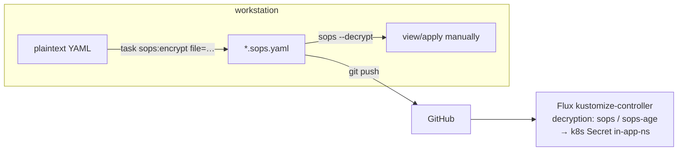

# 04 — Secrets & SOPS

All cluster secrets are **SOPS-encrypted with Age** and committed to the repo as `*.sops.yaml`.
Flux decrypts them in-cluster (no manual `kubectl` apply needed after bootstrap); Ansible
decrypts them on the workstation.

## Keys

| File | Content | Git |
|------|---------|-----|
| `age.key` (repo root) | Age **private** key (`age1tew57…` ↔ public `age1tew57ke6dm4dg26ds595fjj4lmf52s4j20ewnm0d2yrkmekqaqtqjv2fjq`) | **gitignored** — lives only on your workstation |
| `.sops.yaml` (repo root, generated) | SOPS creation rules: `kubernetes/.*\.sops\.ya?ml` and `ansible/.*\.sops\.ya?ml` encrypt `^(data\|stringData)$` with the age pub key; also a `/dev/stdin` rule for ansible-sops | committed |
| `kubernetes/flux/vars/cluster-secrets.sops.yaml` | The `cluster-secrets` Secret (substitution vars; see 03) | committed, encrypted |
| `kubernetes/flux/vars/cluster-secrets-user.sops.yaml` | Personal extra secrets (placeholder only right now) | committed, encrypted |
| `<app>/app/secret.sops.yaml` (per app) | App-specific secrets | committed, encrypted |
| `kubernetes/bootstrap/github-deploy-key.sops.yaml` | (optional) SSH deploy key for private-repo Flux | not created here (repo is public) |

`.envrc` sets `SOPS_AGE_KEY_FILE=./age.key` — with `direnv` active every `sops` command
works without flags.

## The workflow



1. **Write** the secret file in **plaintext** YAML (a `v1 Secret` with `stringData:`) at
   `kubernetes/apps/<ns>/<app>/app/secret.sops.yaml`.
2. **List it** in the app's `app/kustomization.yaml` `resources:`.
3. **Encrypt**: `task sops:encrypt file=kubernetes/apps/<ns>/<app>/app/secret.sops.yaml`
   (in-place; only `data`/`stringData` values are encrypted, keys stay visible).
4. **Commit + push** — Flux decrypts and creates the Secret automatically
   (the `cluster-apps` Kustomization patch adds `decryption: sops / sops-age` to every app
   Kustomization, see [01-architecture.md](01-architecture.md)).
5. **Reference it** from the HelmRelease via `secretKeyRef` / `envFrom` (see examples in
   [90-sop-add-app.md](90-sop-add-app.md)).

Useful one-liners (direnv active):

```sh
sops --decrypt kubernetes/apps/<ns>/<app>/app/secret.sops.yaml        # view
sops --decrypt <file> | kubectl apply -f -                            # manual apply (e.g. before Flux exists)
sops rotatekey --filename <file> ...                                # (only if you change the age key)
```

⚠ `task sops:decrypt` is **broken** in this repo: the task passes `{{.SECRET}}` (undefined)
instead of `{{.file}}`, so it runs `sops --decrypt --in-place` with no file. Use the plain
`sops` commands above. (`task sops:age-keygen` and `task sops:encrypt` work.)

## Secret inventory (key names — values encrypted)

| File | Secret name (ns) | Keys |
|------|------------------|------|
| `kubernetes/flux/vars/cluster-secrets.sops.yaml` | `cluster-secrets` (flux-system) | `SECRET_DOMAIN`, `SECRET_ACME_EMAIL`, `SECRET_CLOUDFLARE_TUNNEL_ID`, `NFS_SERVER`, `NFS_TV`, `NFS_TV2`, `NFS_MOVIES`, `NFS_MUSIC`, `NFS_BACKUP` |
| `kubernetes/flux/vars/cluster-secrets-user.sops.yaml` | `cluster-secrets-user` (flux-system) | `SECRET_PLACEHOLDER` |
| `cert-manager/cert-manager/issuers/secret.sops.yaml` | `cert-manager-secret` (cert-manager) | `api-token` (Cloudflare DNS-01) |
| `network/cloudflared/app/secret.sops.yaml` | `cloudflared-secret` (network) | `TUNNEL_ID`, `credentials.json` (tunnel token+secret; mounted as creds file) |
| `network/external-dns/app/secret.sops.yaml` | `external-dns-secret` (network) | `api-token` (Cloudflare) |
| `flux-system/addons/webhooks/github/secret.sops.yaml` | `github-webhook-token-secret` (flux-system) | `token` |
| `default/homepage/app/secret.sops.yaml` | `homepage-secret` (default) | `HOMEPAGE_VAR_{CLOUDFLARED_ACCOUNTID,CLOUDFLARED_API_TOKEN,CLOUDFLARED_TUNNELID,GRAFANA_PASSWORD,GRAFANA_USERNAME}` |
| `home/firefly-iii/app/secret.sops.yaml` | `firefly-iii-secrets` (home) | `API_KEY`, `APP_KEY`, `POSTGRES_DB`, `POSTGRES_HOST`, `POSTGRES_PASS`, `POSTGRES_USER` |
| `media/lidarr/app/secret.sops.yaml` | `lidarr-secret` (media) | `arlToken`, `plexToken`, `plexUrl` — **commented out of its kustomization** |
| `media/piped/app/secret.sops.yaml` | `piped-secret` (media) | `DB_PASSWORD`, `DB_USERNAME`, `hostname`, `password`, `username` |
| `media/ultrasonics/app/secret.sops.yaml` | `ultrasonics-secret` (media) | `arlToken`, `plexToken`, `plexUrl` |
| `media/youtarr/app/secret.sops.yaml` | `youtarr-secret` (media) | `POSTGRES_HOST`, `POSTGRES_PASS`, `POSTGRES_USER` |
| `observability/grafana/app/secret.sops.yaml` | `grafana` (observability) | `admin-password`, `admin-user` |
| `database/postgresql/app/secret.sops.yaml` | `postgresql-secret` (database) | `password` |

Check each app's `app/kustomization.yaml` to see which of its `secret.sops.yaml` files are
**active** (some are commented out — see the app catalog for the per-app truth).

## Rules of the road

- **Never** commit plaintext `stringData` outside `bootstrap/vars/` (which is gitignored).
- If you add a new `*.sops.yaml`, run `task sops:encrypt` before committing; a plaintext
  secret in git is the failure mode to avoid. `.github/workflows/lychee.yaml` et al. won't
  catch it — but `flux build`/`flux-local` diff will show the `sops:` metadata as noise.
- Editing an encrypted file: decrypt → edit → re-encrypt → commit.
  `sops --decrypt --in-place` then `sops --encrypt --in-place` (the `sops:decrypt` task is
  broken, see above).
- Rotating a key used in multiple places (e.g. `cloudflared-secret` is also in
  `bootstrap/vars/config.yaml`): update `bootstrap/vars/config.yaml` → `task configure`
  re-encrypts everything consistently. For one-off app secrets, decrypt/edit/re-encrypt.
- `sops-age` (the flux-system secret holding the age **private** key) is created **only** by
  `task flux:bootstrap`; never delete it — deleting it bricks decryption of every app.
- Ansible uses the `community.sops` plugin (`ANSIBLE_VARS_ENABLED=host_group_vars,community.sops.sops`)
  to read `ansible/**/*.sops.yaml` vars with the same age key.
