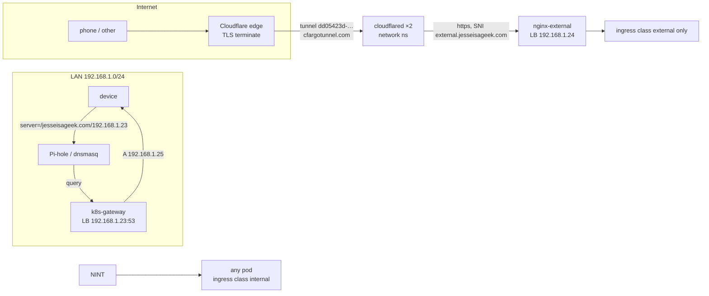

# 06 — Networking

Everything in the cluster is reached over HTTP(S) through **two ingress-nginx
controllers** (`network` ns) with two ingress classes, and the two paths
(LAN vs internet) have completely different DNS machinery.

## The two paths



| | LAN path | Public path |
|---|---|---|
| DNS | split DNS on your home DNS box → **k8s-gateway** (a CoreDNS plugin, LB `192.168.1.23`) | Cloudflare (the zone's real public DNS) |
| Name resolution | `*.jesseisageek.com` → **192.168.1.25** (nginx-internal's LB IP, from the Ingress `status.loadBalancer`) | `<app>.jesseisageek.com` CNAME → `external.jesseisageek.com` CNAME → `<tunnel-id>.cfargotunnel.com` |
| Edge | nginx-internal controller, class `internal` (**default class**) | Cloudflare edge → `cloudflared` tunnel → nginx-external controller, class `external` |
| TLS | Let's Encrypt cert (internal cert chain, `*.jesseisageek.com`) served by nginx-internal | terminated at Cloudflare; inside the tunnel it's TLS to `external.jesseisageek.com` (the production wildcard cert) |
| Real client IP | `--enable-real-ip` | `--enable-real-ip` + PROXY protocol; the JSON log records `$proxy_protocol_addr` |

**k8s-gateway details**: chart `k8s-gateway` 2.1.0 (repo `k8s-gateway`), one CoreDNS
instance with the `k8s_gateway` plugin authoritative for `jesseisageek.com`
(`domain: ${SECRET_DOMAIN}`, `ttl: 1`), port 53, LB IP pinned by
`io.cilium/lb-ipam-ips: 192.168.1.23`. It watches **Ingress** resources and
resolves any `host` in the zone to that Ingress's `status.loadBalancer` IP, and
**LoadBalancer Services** to their LB IP (or to the value of a
`coredns.io/hostname` / `external-dns.alpha.kubernetes.io/hostname` annotation).
So:

- `sonarr.jesseisageek.com` → 192.168.1.25 (the internal ingress for sonarr)
- `internal.jesseisageek.com` → 192.168.1.25 (nginx-internal service annotation)
- `external.jesseisageek.com` → 192.168.1.24 (nginx-external service annotation —
  from the LAN you can also reach the public controller directly)

The home DNS box needs exactly one line (Pi-hole):
`server=/jesseisageek.com/192.168.1.23` — everything else falls back to normal
upstream DNS, which is why **public** names (the frontend suite, gitea, piped, …)
still work on the LAN: the split-DNS box can't be reached by non-LAN devices, but
LAN devices querying `breezewiki.jesseisageek.com` get 192.168.1.25 (the
ingress) — and since those ingresses are class `external`, they only exist on
nginx-external… see the gotcha below.

> ⚠ **Gotcha — external-class apps on the LAN**: k8s-gateway resolves
> `breezewiki.jesseisageek.com` → 192.168.1.25 (nginx-**internal**), but the
> breezewiki ingress is class **`external`**, so nginx-internal has no route for
> it → 404 on the LAN unless you also resolve through `192.168.1.24`. In practice
> the tunnel's config proxies `*.${SECRET_DOMAIN}` to nginx-external, and the
> LAN's public DNS (from phones off-VPN) hits Cloudflare → works. If you find an
> external app 404ing on a LAN device, that's why; the clean fix is to query the
> split-DNS box differently per record or accept the public path for those names.

## Public DNS records (what external-dns manages)

`external-dns` (chart 1.14.1) runs with:

```
provider: cloudflare            # token from external-dns-secret/api-token
--ingress-class=external        # only ingresses of class "external"
--cloudflare-proxied            # orange cloud (proxied) on everything it manages
--crd-source / sources: [crd, ingress]
domainFilters: [jesseisageek.com]
policy: sync, txtPrefix: k8s.
```

Records it owns (all proxied):

| Record | Type | Target | Source in repo |
|--------|------|--------|----------------|
| `external.jesseisageek.com` | CNAME | `dd05423d-4a17-44eb-8b50-0aed214b83b3.cfargotunnel.com` | **`DNSEndpoint` CR** in `apps/network/cloudflared/app/dnsendpoint.yaml` (the CRD itself is pre-installed by `external-dns/app/dnsendpoint-crd.yaml`) |
| each public app host (see table below) | CNAME | `external.jesseisageek.com` | Ingress annotation `external-dns.alpha.kubernetes.io/target: "external.${SECRET_DOMAIN}"` + `enabled: "true"` |

So the public chain is: `app.jesseisageek.com` → (CF) → `external.jesseisageek.com`
→ (CF) → `<tunnel-id>.cfargotunnel.com` → cloudflared → nginx-external → app.

The Cloudflare tunnel itself: `cloudflared` config (ConfigMap `cloudflared-configmap`,
from `app/configs/config.yaml`) tunnels **the whole domain** — `*.${SECRET_DOMAIN}`
and the apex — to `nginx-external-controller.network.svc:443` with SNI
`external.${SECRET_DOMAIN}`. Credentials live in `cloudflared-secret`
(`credentials.json` + `TUNNEL_ID`; the token/secret in `bootstrap/vars/config.yaml`).
cloudflared's Kustomization `dependsOn: [external-dns]` — the tunnel's DNS
endpoint lands after the DNS controller exists.

## Public-facing apps (URL registry)

All public URLs are `*.jesseisageek.com` through Cloudflare (proxied). "Status"
= currently deployed or not (see [apps/README.md](apps/README.md)).

| URL | App | ns | Notes |
|-----|-----|----|-------|
| `echo-server.jesseisageek.com` | echo-server | network | tunnel/public-DNS health check; echoes the request |
| `gitea.jesseisageek.com` | gitea | home | self-hosted git (public by choice) |
| `grocy.jesseisageek.com` | grocy | home | garden manager |
| `breezewiki.jesseisageek.com` | breezewiki | frontend | personal markdown wiki |
| `librarian.jesseisageek.com` | librarian | frontend | bibliography manager |
| `libreddit.jesseisageek.com` | libreddit (Redlib) | frontend | private Reddit frontend (NSFW on by default) |
| `libremdb.jesseisageek.com` | libremdb | frontend | movie/TV ratings |
| `priviblur.jesseisageek.com` | priviblur | frontend | privacy status dashboard |
| `quetre.jesseisageek.com` | quetre | frontend | Q&A board |
| `rimgo.jesseisageek.com` | rimgo | frontend | image host |
| `scribe.jesseisageek.com` | scribe | frontend | collaborative markdown |
| `piped.jesseisageek.com` | piped UI | media | YouTube front-end |
| `pipedapi.jesseisageek.com` | piped API | media | the REST API |
| `ytproxy.jesseisageek.com` | ytproxy | media | stream proxy |
| `flux-webhook.jesseisageek.com` | github-receiver | flux-system | the GitOps webhook endpoint |
| `bitwarden.jesseisageek.com` | vaultwarden | security | **intended, not deployed** (build broken — see apps/security.md) |
| `jesseisageek.com` (apex) | (tunneled) | — | also proxied through the tunnel → nginx-external |
| `external.jesseisageek.com` | (tunnel entry) | — | CNAME to `<tunnel>.cfargotunnel.com` |

**Everything else is internal-only** (`className: internal`, default):
`home.` (homepage), `sonarr.`, `radarr.`, `lidarr.`, `prowlarr.`, `sabnzbd.`,
`overseerr.`, `youtarr.`, `jellyfin.` (dormant), `actual.`, `firefly.`,
`firefly-importer.`, `homarr.`, `joplin.`, `mealie.`, `postgres.`, `grafana.`,
`prometheus.`, `kubernetes.`, `hubble.`, `longhorn.`, `internal.` — reachable
from the LAN via split-DNS, **not** from the internet.

## Internal cluster networking

- **Cilium** is the CNI and replaces kube-proxy (DSR load balancing,
  `bootstrap_cilium_loadbalancer_mode: dsr`).
- **Static IPs** (LoadBalancers) via `io.cilium/lb-ipam-ips` annotations +
  **L2 announcements** (`CiliumL2AnnouncementPolicy` + `CiliumLoadBalancerIPPool`
  over the node CIDR, in `kube-system/cilium/app/cilium-l2.yaml`) — this is how
  the LB IPs (192.168.1.22–.25) exist on the LAN at all: Cilium announces them
  on the network segment.
- **Pods** `10.42.0.0/16`, **Services** `10.43.0.0/16`, **kube API** 192.168.1.22
  (kube-vip), **CoreDNS** clusterIP 10.43.0.10.
- **No NetworkPolicies** are applied (the Flux bootstrap even strips the ones in
  the flux install manifests); the ingress classes + Cloudflare are the boundary.
- **Service mesh / Gateway API**: not used (k8s-gateway *can* read Gateway API
  routes, but none are deployed).
- **WireGuard VPNs** (optional addons, off by default —
  [apps/vpn.md](apps/vpn.md)): clients connect straight to the k3s nodes'
  NodePorts (wireguard `192.168.1.20:31822` UDP; wg-easy `192.168.1.20:30200`
  UDP / UI `:30201`) — no DNS or ingress involved.

## Debugging network paths

```sh
# LAN path
dig @192.168.1.23 sonarr.jesseisageek.com +short      # expect 192.168.1.25
curl -vkI https://sonarr.jesseisageek.com             # from a LAN box

# Public path
dig external.jesseisageek.com                          # expect CNAME to cfargotunnel
curl -vkI https://echo-server.jesseisageek.com         # from anywhere with internet

# Inside the cluster
kubectl -n network get svc -o wide                      # LB IPs
kubectl -n <ns> get ingress                             # host + class
kubectl -n network logs deploy/cloudflared              # tunnel state
kubectl -n network logs deploy/external-dns             # DNS sync
kubectl -n network logs -l app.kubernetes.io/name=ingress-nginx   # request logs (JSON)
```
