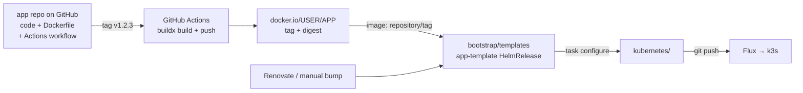

# 93 — SOP: Turn a Service in a Git Repo into a Running App

Full pipeline for a service whose code lives in its own git repo (not this one):



Two halves, two repos:

- **App repo** (yours, elsewhere): code + `Dockerfile` + a GitHub Actions workflow that
  builds and pushes the image on tag.
- **This repo**: the app-template HelmRelease (per [92-sop-add-app-from-template.md](92-sop-add-app-from-template.md))
  that pins `image.repository` + `image.tag`.

Conventions used throughout:

- **Tag = version.** Build on `v*` semver tags (immutable images); never deploy `:latest`.
- **Registry = Docker Hub** (`docker.io/<user>/<app>`). (ghcr.io also works and has no
  pull rate limits, but needs an `imagePullSecret` with a GitHub token for *public*
  images too — Docker Hub is the low-friction choice for a homelab.)
- **Non-root runtime user with UID 1000** — matches `PUID/PGID: 1000` that app-template
  sets, so Longhorn PVC mounts don't fight over permissions.
- **A real health endpoint** — k8s probes and `HEALTHCHECK` both need it.

---

## Part 1 — the app repo

### 1.1 Layout (both examples share this)

```
myapp/
├── .github/workflows/docker.yml
├── Dockerfile
├── .dockerignore
└── (language files: package.json, src/… / pyproject.toml, app/…)
```

`.dockerignore`: `node_modules/`, `__pycache__/`, `.git/`, `*.md` — keep the build
context small.

### 1.2 Dockerfile: Node/TypeScript web server

Example service: an Express + TypeScript API on port 3000
(`src/index.ts`: `app.get('/healthz') → {ok:true}`, `app.get('/api/...')` handlers).

```dockerfile
# --- deps: install everything, including devDeps (tsc, eslint)
FROM node:24-alpine AS deps
WORKDIR /app
COPY package.json package-lock.json ./
RUN npm ci

# --- build: compile TS, then prune to production deps only
FROM node:24-alpine AS build
WORKDIR /app
COPY --from=deps /app/node_modules ./node_modules
COPY . .
RUN npm run build                                  # tsc -p tsconfig.json -> dist/
RUN npm prune --omit=dev

# --- runtime: only what's needed to serve
FROM node:24-alpine AS runtime
WORKDIR /app
ENV NODE_ENV=production
COPY --from=build /app/node_modules ./node_modules
COPY --from=build /app/dist ./dist
COPY --from=build /app/package.json ./package.json
USER node                                          # uid 1000 in the official image
EXPOSE 3000
HEALTHCHECK --interval=30s --timeout=3s --start-period=10s \
  CMD wget -qO- http://127.0.0.1:3000/healthz || exit 1
CMD ["node", "dist/index.js"]
```

Notes:

- **`node:24-alpine`** — Node 24 is the active LTS line (2026). If your app uses
  **native modules** (`sharp`, `better-sqlite3`, `esbuild`, …), switch the base to
  `node:24-slim` (glibc) — alpine is musl and those often fail to build/run.
  Slim images are bigger but far more compatible.
- `USER node` = uid **1000** in the official Node images — deliberate, so
  `PUID/PGID: 1000` in the HelmRelease maps cleanly onto Longhorn volumes.
- alpine has `busybox wget` for the `HEALTHCHECK`; on `-slim` use
  `CMD python -c "import urllib.request;urllib.request.urlopen('http://127.0.0.1:3000/healthz')"`
  style (or install `curl`).

### 1.3 Dockerfile: Python service

Example: FastAPI on uvicorn, port 8000.

```dockerfile
FROM python:3.12-slim AS runtime
WORKDIR /app
# build deps in a layer that survives requirements.txt changes
COPY pyproject.toml ./
RUN pip install --no-cache-dir .        # or: pip install --no-cache-dir -r requirements.txt
COPY . .
# official images have a non-root `uvicorn` user (uid 1000)
USER uvicorn
ENV PYTHONUNBUFFERED=1
EXPOSE 8000
HEALTHCHECK --interval=30s --timeout=3s --start-period=15s \
  CMD python -c "import urllib.request; urllib.request.urlopen('http://127.0.0.1:8000/health')" || exit 1
CMD ["uvicorn", "app.main:app", "--host", "0.0.0.0", "--port", "8000", "--workers", "1"]
```

Notes:

- `python:3.12-slim` = conservative default in 2026 (3.13 is out, 3.14 arriving).
- **One worker** unless you know you need more — a home service rarely benefits, and
  multiple workers + in-process state (caches, sessions) is a bug farm.
- The `/health` endpoint in your app (returning 200) is what the k8s probes will hit.
- Don't bake secrets in; they come from the cluster-side sops secret (Part 2).

### 1.4 (Brief) Go / Rust single-binary

- **Go**: `FROM golang:1.25-alpine AS build` → `CGO_ENABLED=0 go build -o /out/app`
  → `FROM alpine:3.21`, copy the binary, `USER 1000` (create the user or use numeric
  `USER 1000:1000`). Tiny image, no runtime deps.
- **Rust**: `FROM rust:1.8x-slim AS build` → `cargo build --release`
  → `FROM debian:trixie-slim` (or distroless), copy `target/release/<bin>`,
  `USER 1000`.

### 1.5 CI: build + push on tag

`.github/workflows/docker.yml` in the **app repo**:

```yaml
name: docker
on:
  push:
    tags: ["v*"]
  workflow_dispatch:

jobs:
  push:
    runs-on: ubuntu-latest
    permissions:
      contents: read      # for GHA cache
      packages: none      # not pushing to ghcr
    steps:
      - uses: actions/checkout@v4

      - uses: docker/setup-buildx-action@v3

      - uses: docker/login-action@v3
        with:
          registry: docker.io
          username: ${{ secrets.DOCKERHUB_USERNAME }}
          password: ${{ secrets.DOCKERHUB_TOKEN }}

      - uses: docker/metadata-action@v5
        id: meta
        with:
          images: docker.io/${{ secrets.DOCKERHUB_USERNAME }}/myapp
          tags: |
            type=ref,event=tag        # v1.2.3 -> "1.2.3"
            type=sha,prefix=sha-      # sha-<short> for manual workflow_dispatch runs
            type=raw,value=latest,enable={{ is_tag }}

      - uses: docker/build-push-action@v6
        with:
          context: .
          platforms: linux/amd64       # this cluster is x64; add linux/arm64 for multi-arch
          push: true
          tags: ${{ steps.meta.outputs.tags }}
          labels: ${{ steps.meta.outputs.labels }}
          cache-from: type=gha
          cache-to: type=gha,mode=max
```

- Add **`DOCKERHUB_USERNAME`** and **`DOCKERHUB_TOKEN`** (a *read/write* personal
  access token, scope "Account → Registry: images") to the **app repo's**
  Settings → Secrets.
- `platforms: linux/amd64` only — this k3s cluster is x64. Multi-arch
  (`linux/amd64,linux/arm64`) costs ~2× build time and buys nothing here.
- Tagging on every `v*` push means "cut a version" = `git tag v1.2.4 && git push
  --tags`.

### 1.6 Local test before pushing

```sh
docker buildx build --load -t myapp:dev .
docker run --rm -p 3000:3000 myapp:dev
curl -s localhost:3000/healthz
```

---

## Part 2 — this repo: deploy the image

Follow [92-sop-add-app-from-template.md](92-sop-add-app-from-template.md); this part
is the app-template-specific values for an image **you** built.

### 2.1 Create the app template

```sh
cd bootstrap/templates
cp -r kubernetes/apps/home/joplin kubernetes/apps/<ns>/<app>   # base shape
```

Edit `ks.yaml.j2` (name/path) and `app/helmrelease.yaml.j2`:

```yaml
spec:
  chart:
    spec:
      chart: app-template
      version: 2.4.0
      sourceRef: { kind: HelmRepository, name: bjw-s, namespace: flux-system }
  values:
    controllers:
      main:
        annotations:
          reloader.stakater.com/auto: "true"
        containers:
          main:
            image:
              repository: docker.io/jesseisageek/myapp
              tag: 1.2.3            # pinned to a published tag — never "latest"
            env:
              PORT: &port 3000
            probes:
              liveness: &probes
                enabled: true
                custom: true
                spec:
                  httpGet: { path: /healthz, port: *port }
                  periodSeconds: 30
                  failureThreshold: 3
              readiness: *probes
              startup:
                enabled: true
                spec:
                  httpGet: { path: /healthz, port: *port }
                  periodSeconds: 5
                  failureThreshold: 30   # up to 150s to boot
    service:
      main:
        ports:
          http: { port: *port }
    ingress:
      main:
        enabled: true
        className: internal
        hosts:
          - host: &host "myapp.${SECRET_DOMAIN}"
            paths:
              - { path: /, pathType: Prefix, service: { name: main, port: http } }
        tls:
          - hosts: [*host]
    env:
      TZ: ${TIMEZONE}
      PUID: 1000
      PGID: 1000
    podSecurityContext:
      supplementalGroups: [1000]
    # persistence: ...      # only if the app has state; Longhorn 1-8Gi
```

Register `- ./<app>/ks.yaml` in the namespace kustomization template, then
`./deploy.sh "add <app>"` (or `task configure` + commit/push). Verify per SOP 92 step 5.

### 2.2 Pull auth (only if you hit Docker Hub rate limits)

Docker Hub limits (as of 2026): **unauthenticated 100 pulls / 6h / IPv4**;
**authenticated personal 200 / 6h**; 429s return a docs link (vs the bare 429 of the
abuse limit). A 2-node homelab rarely hits 100/6h — but Renovate bumps, crashes, and
reschedules do pull. If you ever see `429` in `kubectl describe pod`, add a
dockerconfigjson secret (in the app template, sops-encrypted):

```yaml
# app/secret.sops.yaml.j2  — one key; values are Jinja from bootstrap/vars/config.yaml
---
apiVersion: v1
kind: Secret
metadata:
  name: dockerhub-pull
type: kubernetes.io/dockerconfigjson
stringData:
  .dockerconfigjson: |-
    {"auths":{"docker.io":{"username":"{{ dockerhub_username }}","password":"{{ dockerhub_token }}","auth":"{{ dockerhub_auth }}"}}}
```

(+ `dockerhub_*` vars in `bootstrap/vars/config.yaml`, `dockerhub_auth` =
`base64("user:token")`), list it in `app/kustomization.yaml.j2`, and add to the
HelmRelease values:

```yaml
    imagePullSecrets:
      - dockerhub-pull
```

### 2.3 Keeping the image up to date

- **Manual** (works today): bump `tag:` in the template → `./deploy.sh "bump <app>"`.
- **Renovate** (the better way, one-time setup): the current `.github/renovate.json5`
  only scans `kubernetes/`, `addons/`, `ansible/` — **not `bootstrap/templates/`** —
  so template images are invisible to it. Add the templates to the `flux` manager's
  fileMatch (its `image.repository`/`image.tag` handling will then pick up your app):

  ```json5
  "flux": {
    "fileMatch": [
      "(^|/)addons/.+\\.ya?ml(\\.j2)?(\\.j2)?$",
      "(^|/)ansible/.+\\.ya?ml(\\.j2)?(\\.j2)?$",
      "(^|/)kubernetes/.+\\.ya?ml(\\.j2)?(\\.j2)?$",
      "(^|/)bootstrap/templates/.+\\.ya?ml(\\.j2)?$"     // ← add
    ]
  },
  ```

  Your `docker.io/<user>/<app>` image resolves through the standard `docker`
  datasource (no `registryUrls` needed for Docker Hub). Renovate then opens
  `update(image) myapp to 1.3.0` PRs on Saturdays against the **template** — and the
  flux-diff workflow shows the resulting cluster diff.
  (Files with real Jinja (`secret.sops.yaml.j2` etc.) may confuse YAML-parsing
  managers; the app HelmRelease templates are plain YAML, so this is safe in
  practice — if a file chokes Renovate, exclude it with a `fileMatch` negation.)

---

## Worked example, end to end

**App**: `todo-api` — a TypeScript/Express TODO JSON API, repo
`github.com/jesseisageek/todo-api`.

1. **App repo** — `src/index.ts`:

   ```ts
   import express from "express";
   const app = express();
   app.use(express.json());
   const todos: Array<{ id: number; text: string; done: boolean }> = [];
   let next = 1;
   app.get("/healthz", (_r, res) => res.json({ ok: true }));
   app.get("/api/todos", (_r, res) => res.json(todos));
   app.post("/api/todos", (r, res) => {
     const t = { id: next++, text: String(r.body.text ?? ""), done: false };
     todos.push(t);
     res.status(201).json(t);
   });
   app.listen(3000, () => console.log("todo-api up"));
   ```

   `package.json` (`express`, `@types/express`, `typescript`; script
   `"build": "tsc -p ."`), plus the Dockerfile from §1.2 and the workflow from §1.5
   (metadata `images: docker.io/jesseisageek/todo-api`).

2. **Cut a version**: `git tag v0.1.0 && git push --tags` → Actions builds
   `docker.io/jesseisageek/todo-api:0.1.0`.

3. **This repo**:
   ```sh
   cd bootstrap/templates
   cp -r kubernetes/apps/default/homepage kubernetes/apps/default/todo-api   # or any app-template base
   # ks.yaml.j2: name cluster-apps-todo-api, path ./kubernetes/apps/default/todo-api/app
   # app/helmrelease.yaml.j2: image docker.io/jesseisageek/todo-api:0.1.0, port 3000,
   #   probes /healthz, ingress todo-api.${SECRET_DOMAIN} internal, no persistence (stateless)
   ```
   Add `- ./todo-api/ks.yaml` to `kubernetes/apps/default/kustomization.yaml.j2` →
   `./deploy.sh "add todo-api"` → Flux deploys → `http://todo-api.jesseisageek.com/api/todos`
   from the LAN.

4. **Ship a fix**: in the app repo `git tag v0.1.1` → (Renovate PR or manual)
   bump `tag: 0.1.1` in the template → `./deploy.sh` → done.

**Python variant** (`invoice-svc`, FastAPI): same shape; Dockerfile from §1.3,
`image: docker.io/jesseisageek/invoice-svc:1.0.0`, `PORT: 8000`, probes on `/health`,
`image.repository`/`tag` as above. Everything else identical.

---

## Gotchas

- **`:latest` is a trap** — k8s re-pulls `latest` on every pod create (no cache) and
  you lose immutability. Pin tags; let tags mean releases.
- **429 / `ImagePullBackOff`** → rate limit (§2.2) or a typo'd image name (`docker.io/`
  prefix is optional but the repo must exist and be *public* or the pull secret
  must match the namespace).
- **alpine vs native modules** — if a Node native dep fails to build, switch to
  `node:24-slim`. If a Python dep needs a compiler, `python:3.12-slim` has no
  `gcc` — build wheels in a `python:3.12` builder stage, copy into slim.
- **UID 1000 discipline** — keep the container user at 1000 (or set
  `securityContext.fsGroup: 1000` in the HelmRelease) or Longhorn/NFS mounts will
  be permission-denied.
- **Secrets never in the image** — env/secrets come from the cluster-side
  `secret.sops.yaml.j2` (Jinja from `bootstrap/vars/config.yaml`), matching how every
  other app here gets its config.
- **Renovate can't see `bootstrap/templates/`** until you extend its fileMatch
  (§2.3) — until then, manual bumps only.
- **The app repo's Actions workflow is not managed by this repo** — renovate's
  `github-actions` manager only runs here; if the app repo wants its own
  actions/renovate updates, give it its own `.github/renovate.json` (or don't).
