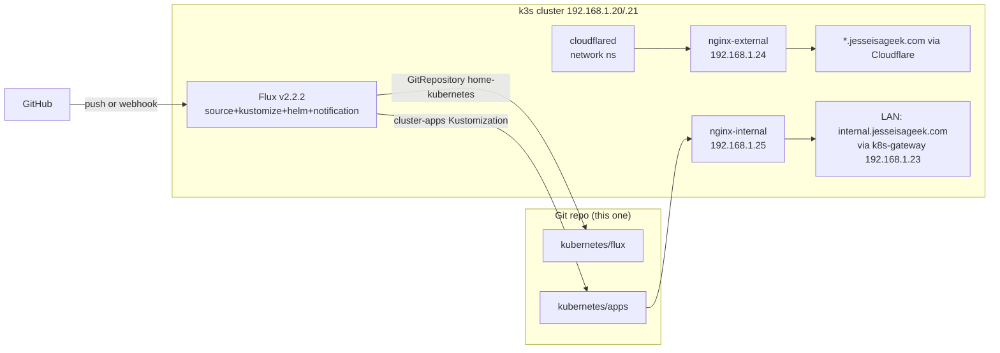

# homeops — Developer Documentation

This repository is a GitOps-deployed **single-node k3s + Flux** home Kubernetes cluster
(`192.168.1.20` master, `192.168.1.21` worker, user `jesse`), based on
[onedr0p/flux-cluster-template](https://github.com/onedr0p/flux-cluster-template).
**Everything the cluster runs is defined in this git repo** — commit here, push, Flux applies it.

## Read order (for agents)

| Doc | What it answers |
|-----|-----------------|
| [01-architecture.md](01-architecture.md) | How the pieces fit: Flux, SOPS/Age, Cloudflare, ingress classes, DNS, storage, monitoring |
| [02-deploy.md](02-deploy.md) | How the cluster was/will be deployed from scratch (Ansible → k3s → Flux → apps) |
| [03-configuration.md](03-configuration.md) | Where every setting lives: `bootstrap/vars/`, Ansible inventory, `kubernetes/flux/vars/`, substitution variables |
| [04-secrets-sops.md](04-secrets-sops.md) | How to encrypt/decrypt/manage secrets (Age keys, SOPS, cluster-secrets) |
| [05-apps/](apps/README.md) | **App catalog** — one page per namespace with every running app, its image/chart, ingress, storage, secrets |
| [06-networking.md](06-networking.md) | How traffic gets in: the two ingress controllers/classes, split-DNS (k8s-gateway), the Cloudflare tunnel + external-dns, **public URL registry** |
| [07-storage.md](07-storage.md) | How data persists: Longhorn (default SC), openeBS hostpath, NFS on 192.168.1.30 — per-app mount map + how to pick a layer |
| [08-versions.md](08-versions.md) | **Version/staleness audit** (2026-08-26 snapshot): every pinned chart/image vs current upstream, floating-tag analysis, notable findings |
| [90-sop-add-app.md](90-sop-add-app.md) | **SOP: add a new app** from a Docker image, a Helm chart, or a Git repo (direct `kubernetes/` edit — for throwaway apps) |
| [91-runbook.md](91-runbook.md) | Day-2 ops: debugging, updates, nuke/rebuild, webhook, common gotchas |
| [92-sop-add-app-from-template.md](92-sop-add-app-from-template.md) | **SOP: add a new app (persistent)** — copy + adapt an existing `bootstrap/templates/` app, then `task configure` |
| [93-sop-image-to-app.md](93-sop-image-to-app.md) | **SOP: service in a git repo → Docker image → Docker Hub → this cluster** (Node/TS, Python examples; CI, pull-auth, updates) |

## Repository map

```
homeops/
├── README.md              # Original template README (full install guide, stages 1-6)
├── Taskfile.yaml          # Entry point: task init / configure / repo:* / sops:* …
├── .taskfiles/            # Task definitions: Ansible, Flux, Kubernetes, K0s, Repo, Sops, Workstation
├── .envrc                 # direnv: KUBECONFIG, SOPS_AGE_KEY_FILE, ansible venv (run `direnv allow`)
├── .sops.yaml             # SOPS encryption rules (Age key for kubernetes/ and ansible/ .sops.yaml files)
├── age.key                # Age PRIVATE key (gitignored; needed by SOPS + flux bootstrap)
├── kubeconfig             # Cluster admin kubeconfig (generated into repo root; .bak copies exist)
├── bin/add_app.py         # Interactive scaffolder for app-template (docker) apps
├── scripts/kubeconform.sh # Schema validation for kubernetes/flux + kubernetes/apps kustomizations
├── bootstrap/             # TEMPLATE SOURCE (generates ./ansible and ./kubernetes via `task configure`)
│   ├── configure.yaml     # Ansible playbook that templates the whole repo
│   ├── vars/
│   │   ├── config.yaml    # ★ Gitignored master config (nodes, IPs, domain, cloudflare, app secrets)
│   │   └── addons.yaml    # Gitignored addon toggles (homepage, grafana, kube-prometheus-stack, …)
│   ├── tasks/             # Validation + per-target template tasks (ansible/k0s/kubernetes/addons)
│   └── templates/         # Jinja2 templates: kubernetes/**, ansible/**, addons/**
├── ansible/               # GENERATED from bootstrap (inventory + k3s playbooks)
│   ├── inventory/hosts.yaml
│   └── playbooks/         # cluster-prepare/-installation/-kube-vip/-nuke/-reboot/-rollout-update
├── kubernetes/            # ★ THE LIVE CLUSTER DEFINITION (Flux consumes exactly this dir)
│   ├── bootstrap/         # Flux install manifests (NOT reconciled by Flux — one-shot install)
│   ├── flux/
│   │   ├── config/        # cluster.yaml (GitRepository + root Kustomization), flux.yaml (Flux self-upgrade)
│   │   ├── apps.yaml      # cluster-apps Kustomization: pulls kubernetes/apps, sops decrypt, var substitution
│   │   ├── repositories/  # helm/ (HelmRepos, HTTP+OCI), git/ (empty), oci/ (empty)
│   │   └── vars/          # cluster-settings(+user) ConfigMap, cluster-secrets(+user).sops.yaml Secret
│   └── apps/<ns>/<app>/   # One dir per app: ks.yaml (Flux Kustomization) + app/ (HelmRelease, etc.)
└── .github/
    ├── workflows/flux-diff.yaml   # PR: flux-local diff of kustomizations/helmreleases (posts as comment)
    ├── renovate.json5             # Dep updates (charts, images, actions) — Saturdays
    └── workflows/                 # e2e (CI of the template), kubeconform, lychee, labeler, release
```

## The 30-second model



Key invariants:

- **Flux only ever reads the `kubernetes/` directory** (`GitRepository` spec has `ignore: /*; !/kubernetes`).
  Nothing outside `kubernetes/` reaches the cluster.
- **Apps are per-namespace**: `kubernetes/apps/<namespace>/` contains `namespace.yaml`, a
  `kustomization.yaml` listing each app's `ks.yaml`, and one directory per app.
- **Each app** has `ks.yaml` (a Flux `Kustomization` named `cluster-apps-<app>`, path
  `./kubernetes/apps/<ns>/<app>/app`) and an `app/` dir (usually a `HelmRelease` + `kustomization.yaml`
  listing extra manifests).
- **Ingress classes**: `internal` (LAN-only, default) and `external` (via Cloudflare tunnel).
  Hosts are `<app>.jesseisageek.com` (`${SECRET_DOMAIN}`).
- **Storage**: Longhorn (local) for configs + NFS on `192.168.1.30` for media pools.
- **Secrets**: SOPS-encrypted `*.sops.yaml` files, Age-encrypted; Flux decrypts them
  (`kubernetes/flux/apps.yaml` sets `decryption: sops / sops-age`).
- **Variables**: `${TIMEZONE}`, `${SECRET_DOMAIN}`, `${NFS_SERVER}`, … are substituted by Flux
  `postBuild` from `cluster-settings` / `cluster-secrets` (see [03-configuration.md](03-configuration.md)).

## Command cheat sheet

```sh
task                    # list tasks (run from repo root; direnv must be active)
task configure          # regenerate ./ansible + ./kubernetes from bootstrap/ (DESTRUCTIVE for hand-edits)
task flux:bootstrap     # one-time: install Flux + sops-age + secrets + config
task flux:reconcile     # force Flux to pull the repo now
task flux:apply path=<ns>/<app>   # build+apply one app's kustomization locally (dry-run if ks missing)
task kubernetes:resources
task k0s:apply / k0s:reset   # (if you ever switch distribution)
task repo:clean         # move bootstrap/ to .private/ after initial deploy
```

Day-2 kubectl/flux:

```sh
kubectl get nodes -o wide
flux get ks -A; flux get hr -A; flux get sources git,oci -A
flux reconcile -n flux-system kustomization cluster-apps-<app>
kubectl -n <ns> get pods,logs,describe …   # see 91-runbook.md
```

## Conventions & gotchas (quick list)

- `kubernetes/` and `ansible/` are **generated** by `task configure` from `bootstrap/`
  (Jinja2 via Ansible — see [02-deploy.md](02-deploy.md) "How the template files work").
  In this fork **every app has a template** (incl. the 5 addons' apps), so hand-edits to
  `kubernetes/` are overwritten on the next `task configure` — change the template, the
  `*-user*` vars files, or use `deploy.sh` to nuke-and-regenerate.
- Some apps in `kubernetes/apps` are community addons contributed to the template
  (e.g. the `frontend/*` suite) — check `bootstrap/templates/kubernetes/apps/` to see which.
- `bootstrap/vars/config.yaml` and `bootstrap/vars/addons.yaml` are **gitignored** and contain
  plaintext secrets — they are the source of truth for what gets templated/encrypted.
- **Three app dirs are not actually deployed** (manifests exist but Flux won't/can't apply them):
  `media/ultrasonics` (ks not registered in `media/kustomization.yaml`),
  `home/transiter` (ks is a copy of overseerr's + unregistered),
  `security/vaultwarden` (registered, but `${SECRET_CLUSTER_DOMAIN}` is undefined → build fails).
  Full details: [the app catalog](apps/README.md).
- The `honeypot/` namespace dir is an empty stub (cowrie/nepenthes dirs have no manifests).
- `kyverno.io/add-ndots` labels on namespace files are leftovers; no Kyverno is deployed.
- Never `kubectl edit` live cluster state for anything durable — Flux will revert it.
- PRs that touch `kubernetes/**` get an automatic `flux-local` diff comment (`.github/workflows/flux-diff.yaml`).
- Local validation before pushing: `./scripts/kubeconform.sh kubernetes`.
